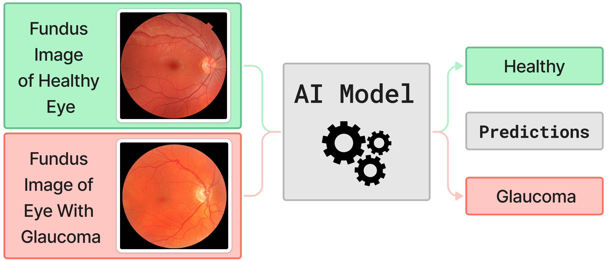

# Ocular Disease Identifier Planning & Documentation 

## Table of Contents
  * [:bulb: Project Description](#-bulb--project-description)
  * [:compass: Implementation Plan](#-compass--implementation-plan)
  * [:clipboard: Team Management](#-clipboard--team-management)
  * [:athletic_shoe: Sprint Planning](#-athletic-shoe--sprint-planning)

## :bulb: Project Description

Did you know that over 30% of Canadians over the age of 65 suffer from ocular diseases such as glaucoma, cataracts, and diabetic retinopathy [1]? Unfortunately, many cases go undiagnosed since it is difficult for optometrists to detect them, particularly in their early stages. Although these diseases are more prevalent in the elderly community, they affect people of all demographics and ages. When left untreated, symptoms of eye disease can quickly worsen, potentially leading to blindness. But what if there were a way to change this? Imagine if we could use machine learning to combat this issue by creating a tool that could help identify these diseases.

The goal of the ocular disease identifier is to both detect any symptoms of ocular disease that go unnoticed during examination, and be able to offer a valid second opinion. This project does not aim to replace professional eye examinations, but is rather meant to act as a failsafe mechanism that accounts for human error. To ensure real world usability, the identifier should be quick, simple to use, and store any patient information securely and in compliance with standard privacy policies.

### Objectives
1. Build and train an AI model to identify ocular diseases using patient fundus images (see Figure 1 below).
2. Develop a secure website that allows Optometrists/Opthamologists to efficiently access the AI model.

<em>Figure 1: High Level Overview of Project Backend.</em>

### Stakeholders

- Opthamologists
- Undiagnosed ocular disease patients

## :compass: Implementation Plan

### Project Timeline

- **Milestone 1 (MVP):** Overview of backend minimum viable product requirements. Build a convolutional neural network (CNN) using TensorFlow. Train the model using a public dataset, such as the following [Kaggle Dataset](https://www.kaggle.com/datasets/andrewmvd/ocular-disease-recognition-odir5k). The model should be functioning for ***only one*** ocular disease (Ex. Glaucoma) at this point.
Date to be completed by: *TBD*
- **Milestone 2 (MVP):** Overview of frontend minimum viable product requirements. Develop an API using a python framework (Ex. Flask, Django, etc.). Develop a user-friendly, and aesthetically pleasing web application that is able to handle requests to the API. The frontend application must be able to accept image files and submit them to the API.
Date to be completed by: *TBD*
- **Milestone 3:** Increase the number of diseases that the model can identify. Analyze potential weaknesses of the model, and modify accordingly to increase overall accuracy. Increase functionality of the web application; implement additional features such as ability to login, drag and drop file upload, and possibly storing of patient information. Note: This would require a database. Date to be completed by: *TBD*
- **Milestone 4:** Implement additional image processing, so that the model will inform the user of the location of the disease (See Figure 2). Host and deploy the application. 

### Tech Stack

- **Frontend Framework Options:**
 - **Web Application:**   
  - **API:**   

 

- **Backend Framework:**
   

- **Other Technologies/Libraries:**
  - Data Processing: 

  - Hosting & Deployment:  

  - Styling Options:    

### Project Structure 
*Describe the high-level structure of the project, including directories, modules, and how components/modules interact. For instance, you may need a frontend directory and a backend directory. In your backend directory you may have a designated module for different components of the project, etc. Keep it high level and don't include biolerplate. Include a diagram if you'd like!*

### API Documentation
*Optional: Include some high-level descriptions of the APIs that will need to be developed. You can organize this however you'd like.*
- **API Endpoint:** [URL]
- **API Documentation Tool:** [e.g., Swagger, Postman]
  
### Testing & CI/CD
*Your project should have a formal testing plan that will complement the code acceptance of each pull request. The tests themselves may be written by your devs, but you should try to define a plan/framework for how they should write/execute their tests. It be great if you could integrate automated testing and deployment, but manual testing works as well. Describe the test plans, metrics/measures you'll use such as coverage, and tools such as specific testing frameworks that match your tech stack, automation tools like GitHub Actions, Jenkins, etc.*

### Hosting 
*Optional: if you plan to use services to host and deploy the application list them below. Later on, you can append an architecture diagram to this section.*
- **Application Hosting:** [e.g., GKE, AWS, Heroku, Azure]
- **Database Hosting:** [e.g., Google Cloud Storage, AWS RDS, MongoDB Atlas]
- **Additional Services:** []

## :clipboard: Team Management

### Team Members
*For now, determine approximately how many developers and of what type you would need for your project. After recruitment and onboarding, list the names that will fulfill each role*
- **Scrum Master & Product Owner:** [Lead's Name]
- **Frontend Developers:**
  - [Name]
  - [Name]
- **Backend Developers:**
  - [Name]
  - [Name]
- **_Other Type_ Developers:**
  - [Name]
  - [Name]
  - [Name]
  

### Team Communication
*You should be meeting with your team mates weekly. For this section, document a meeting frequency for reviews and retrospectives. Times will be chosen after onboarding.*
- **Communication Platform:** Discord
- **Meeting Schedule:**
  - Sprint Review: [Time and Frequency]
  - Sprint Retrospective: [Time and Frequency]
  - Other Meetings: [Specify]

### Roles and Responsibilities
*This section defines the responsibility of each role, you may edit to fit your project's needs.*

- **Scrum Master:**
  - Flush out project's boilerplate 
  - Assign tickets to developers
  - Facilitate scrum ceremonies (sprint reviews, retrospectives)
  - Remove impediments
- **Product Owner:**
  - Define product backlog 
  - Prioritize user stories
  - Accept/reject deliverables
- **Developers:**
  - Develop features through ticket completion
  - Create test cases to for feature/ticket acceptance
  - Thoroughly document code and features through pull requests and README docs
  - Execute tests
  - Report defects

### Collaboration Tools
*Pick a collaboration/organization tool that will be used to define your sprint timelines, including the milestones you defined earlier. You should be able to integrate GitHub issues into this tool, and it should be kept up to date over the course of the project [e.g., GitHub Projects, Kanban boards, etc.]*

### Code Acceptance: The Definition of Done
*You may edit the below DoD to match your project/preferences.*

Below we define the Definition of Done for this project, i.e. what needs to the included in a pull request for the pull request to be accepted by the Product Owner:
- Code Complete (satisfies feature associated to the ticket)
- Passed Code Review by Scrum Master
- Passed Unit Tests/Other testing developed for the feature
- Documentation Updated
- Ready to be integrated with Main Branch (no merge conflicts)

## :athletic_shoe: Sprint Planning
### High Level Goals for Each Sprint
*This section is meant to facilitate your future sprint planning, and allow you to estimate a more detailed project timeline. For each milestone you defined, break it up into 2-4 sprints, and describe the goals as well as expected duration for each sprint.*

#### <u>Milestone 1</u>

**Sprint 1**: [Description of what features will be achieved by the end of this sprint], [Expected length of sprint in weeks (Should be 1-2 weeks)]. 

**Sprint 2**: ...
 
#### <u>Milestone 2</u>

**Sprint 3**: ... 

...

### Sprint Planning 
*Below is a template for sprint planning for your future use. You can follow it as much as you'd like, so long as you're able to generate reasonably sized tickets for your members each sprint, and said tickets will bring you to your milestones by the target date you declared.*

*Some more resources for sprint Planning:*
- *[Atlassian: Sprint Planning](https://www.atlassian.com/agile/scrum/sprint-planning#:~:text=What%20is%20sprint%20planning%3F,with%20the%20whole%20scrum%20team.)*
- *[Scrum in 20 mins](https://www.youtube.com/watch?v=SWDhGSZNF9M&ab_channel=CodexCommunity)*

#### Sprint Duration
- _Sprint Length:_ [e.g., 2 weeks]
- _Start Date:_ [Date]
- _End Date:_ [Date]

#### High Level Sprint Goals
1. Goal 1
2. Goal 2
3. Goal 3

#### User Stories (Sample)

| ID   | User Story                                  | Priority | Story Points | Assignee |
|------|---------------------------------------------|----------|--------------|----------|
| US01 | As a [user role], I want to [feature]       | High     | 5            | Dev A    |
| US02 | As a [user role], I want to [feature]       | Medium   | 3            | Dev B    |
| US03 | As a [user role], I want to [feature]       | Low      | 2            | Dev C    |
